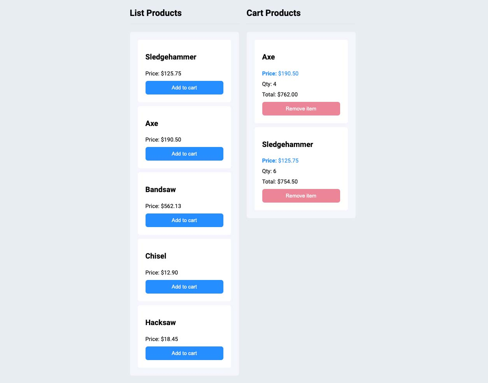

<h4 align="center">
  Basic Shopping Cart
</h4>

  <a href="#-preview">Preview</a>&nbsp;&nbsp;&nbsp;|&nbsp;&nbsp;&nbsp;
  <a href="#-tecnologies">Tecnologies</a>&nbsp;&nbsp;&nbsp;|&nbsp;&nbsp;&nbsp;
  <a href="#-project">Project</a>&nbsp;&nbsp;&nbsp;|&nbsp;&nbsp;&nbsp;
  <a href="#-how-to-deploy-it">How to deploy it</a>&nbsp;&nbsp;&nbsp;|&nbsp;&nbsp;&nbsp;
  <a href="#memo-license">License</a>

 

## Preview

You could see this project on the link [Basic Shopping Cart](https://shopping-cart-react-six.vercel.app/)

  

## 💻 Tecnologies

This project was developed with:

- [React](https://reactjs.org/)
- [Styled Components](https://styled-components.com/)
- [Styled Icons](https://styled-icons.dev/)

## 🔖 Project

This project was developed with the objective of implementing a simple shopping cart in react.

## Why did I decide to use Context?
For this situation the context provides a better way to provide the data in a global way for all components that need it and eventually avoid prop drilling.

## Why did I decide to use Styled Components?
Styled components provide a more semantic visual hierarchy to the code in addition to greater flexibility.

## Why did I decide to use HOC?
HOCs are a great way to reuse repeated logic in more components in a practical way, so I used the HOC `withPriceFunc` to pass functions that I will probably use a lot throughout the application.

## 🤔 How to deploy it
In the project directory, you can run:
- Run the command `yarn install` or `npm install` to install the packages;
- Run the command `yarn start` or `npm start` to run the app in the development mode;
- Open `http://localhost:3000` to view it in your browser;

## :memo: License

This project is under MIT license. See the [LICENSE](LICENSE.md) for more details.